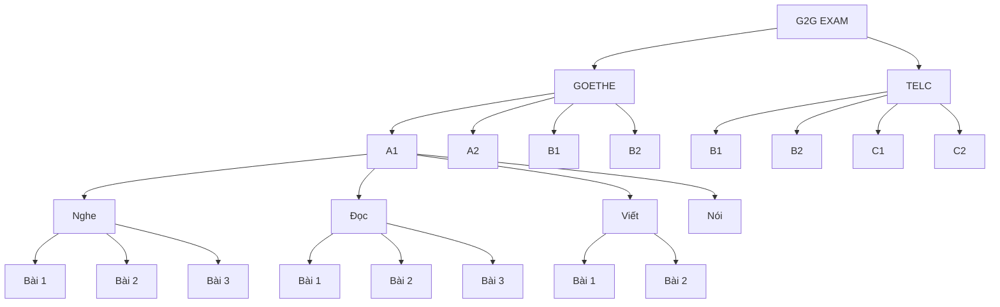
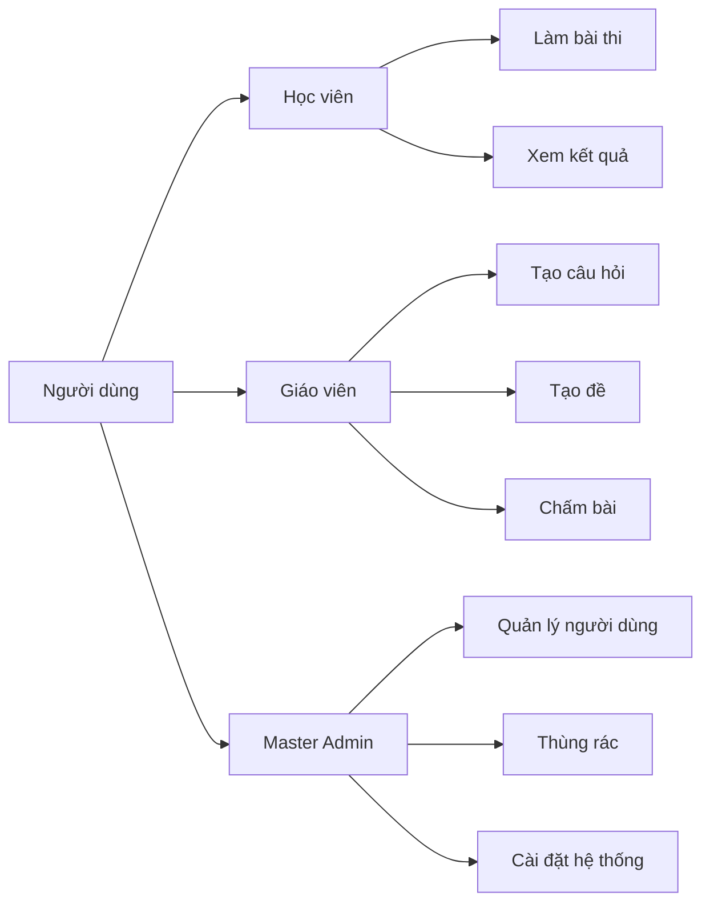
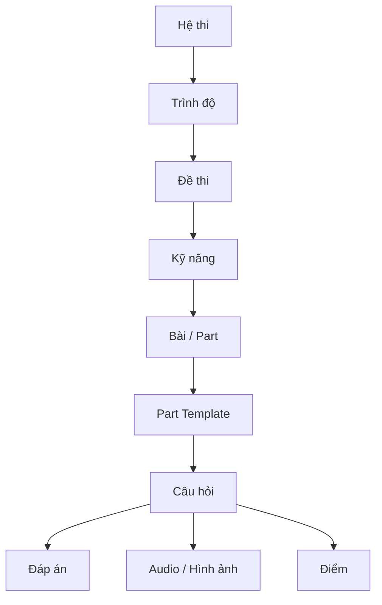
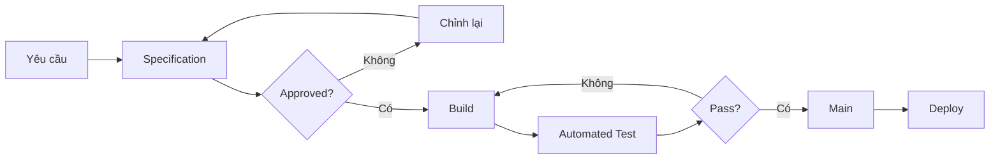

# G2G Exam System

> Bản đồ tổng thể của hệ thống G2G Exam.

---

## 1. System Map

---

## 2. Vai trò người dùng

---

## 3. Cấu trúc một đề thi

---

## 4. Luồng xây dựng chức năng

---

## 5. Source of Truth

Thứ tự ưu tiên:

1. `AGENTS.md` — luật làm việc cho AI.
2. `specs/` — quy tắc nghiệp vụ đã được duyệt.
3. `DECISIONS.md` — các quyết định kiến trúc/nghiệp vụ đã chốt.
4. `ARCHITECTURE.md` — cấu trúc kỹ thuật.
5. Code.
6. Tests.

Specification có trạng thái `APPROVED` là nguồn quy tắc nghiệp vụ chính thức.

---

## 6. Quy tắc phát triển

Không tự suy đoán cấu trúc đề thi.

Mỗi cấu trúc:

    Provider → Level → Skill → Part

có thể có template riêng.

Ví dụ:

    GOETHE.A1.LISTENING.PART_01

không mặc định giống:

    GOETHE.A1.LISTENING.PART_02

---

## 7. Trạng thái Specification

- ⚪ TODO — chưa định nghĩa.
- 🟡 DRAFT — đang xây dựng.
- 🟢 APPROVED — đã chốt, được phép build.
- 🔴 INVALID — có lỗi hoặc thiếu rule.
- 🔒 LOCKED — đã có dữ liệu production cần bảo toàn.
